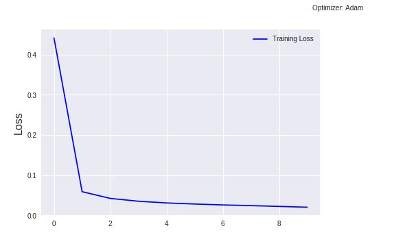

# Part of Speech Tagger
This notebook contains code for neural network that can tag POS in an English sentence. There are many POS tagsets available, here universal tagset has been used. The model converts the sentence to POS tags. Tags used are:

**ADJ - Adjective 
ADP - Adposition
ADV - Adverb 
PRT -	Particle  
PRON - Pronoun 
.	   - Punctuation marks 
X	- Other	 
VERB - Verb 
CONJ	- Conjunction 
DET - Determiner / Article	
NOUN	- Noun	 
NUM - Numeral **

## Test Results

## Training Plot

  Plot after training for 10 epochs. 
  

## Contents:
There are two main files:
- **POS_tagger.ipynb:** Step by step walkthrough the entire code. 
- **pos_tagger.py:** Command line interface for directly running the model for test prediction. Use it to see model prediction for input strings.

  

## Model Architecture
It uses a bidirectional LSTM model. The model achieved a validation accuracy of 96% on validation data.

  

The model can be improved even further. This model was trained only for 10 epochs. Further accuracy can be improved by increasing the number of hidden state units, stacking up more layers, using pretrained word embeddings etc. 

This code is inspired from https://www.coursera.org/learn/language-processing.
